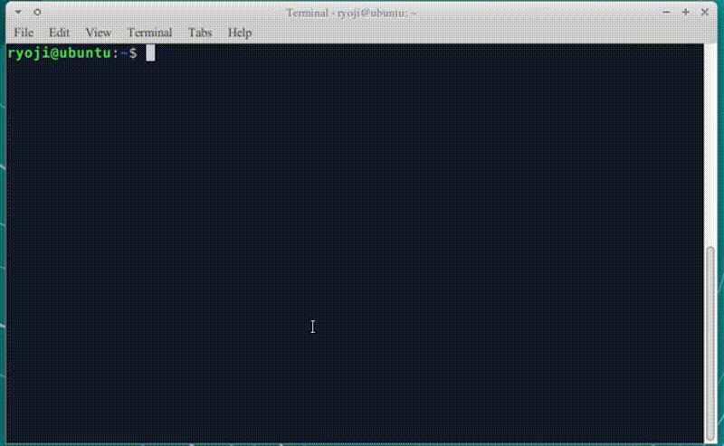
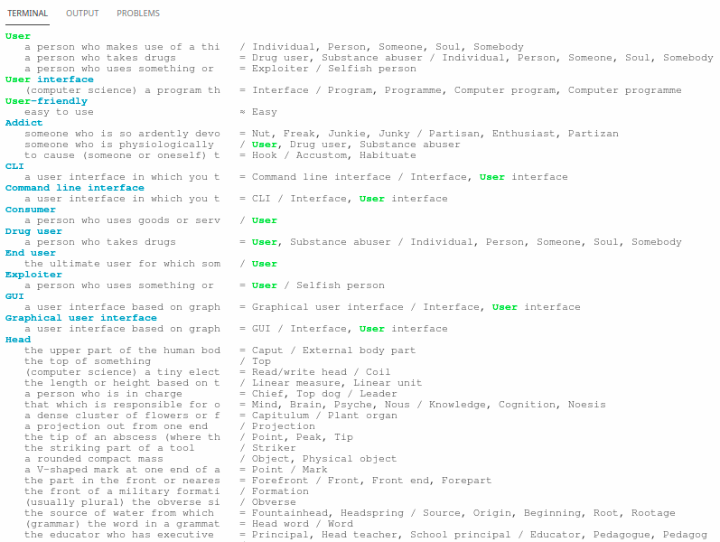
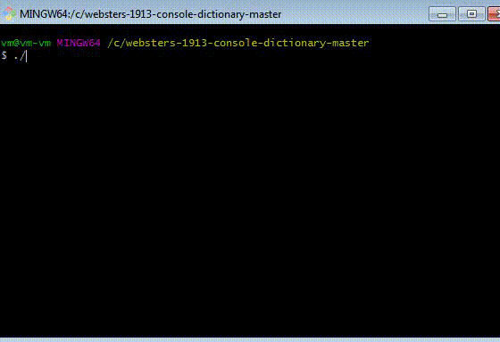

# Websters dictionary, 1913 Edition  <br/> WordNet 2.0 



websters1913 is a command line program for reading Webster's Dictionary, 1913 in a terminal. This program provides the full text search. Application binary contains the dictionary data. It's using `less` as the pager.

Download: https://github.com/growingspaghetti/websters-1913-console-dictionary/releases

# Linux x64



(using in the terminal of my VSCode)


# Windows x64



Use Git bash.

(only old version is available.)

Compiled in Windows 7.

# License

* Public domain: https://en.wiktionary.org/wiki/Wiktionary:Webster%27s_Dictionary,_1913
* Non commercial and research purpose only: svr-ftp.eng.cam.ac.uk/comp.speech/dictionaries/beep.tar.gz
* http://wordnetcode.princeton.edu
```
WordNet 2.0 Copyright 2003 by Princeton University.  All rights reserved. 

THIS SOFTWARE AND DATABASE IS PROVIDED "AS IS" AND PRINCETON  
UNIVERSITY MAKES NO REPRESENTATIONS OR WARRANTIES, EXPRESS OR  
IMPLIED.  BY WAY OF EXAMPLE, BUT NOT LIMITATION, PRINCETON  
UNIVERSITY MAKES NO REPRESENTATIONS OR WARRANTIES OF MERCHANT-  
ABILITY OR FITNESS FOR ANY PARTICULAR PURPOSE OR THAT THE USE  
OF THE LICENSED SOFTWARE, DATABASE OR DOCUMENTATION WILL NOT  
INFRINGE ANY THIRD PARTY PATENTS, COPYRIGHTS, TRADEMARKS OR  
OTHER RIGHTS.  
```
* Rust source code: Public domain 

# Change logs

 * 2019/04/06 v0.1.0
 * 2019/04/07 v0.2.0 pronunciation notations have been added to the websters dictionary.
 * 2019/04/08 created binaries for wordnet 2.0 as well as websters 1913.
 * 2019/12/14 applied line-wrapping on the wordnet data
 * 2021/11/11 v0.3.0
   - upgraded libraries
   - cleaned the text of webster's dictionary
   - changed the layout of wordnet
   - entries start with the searching word come on top
