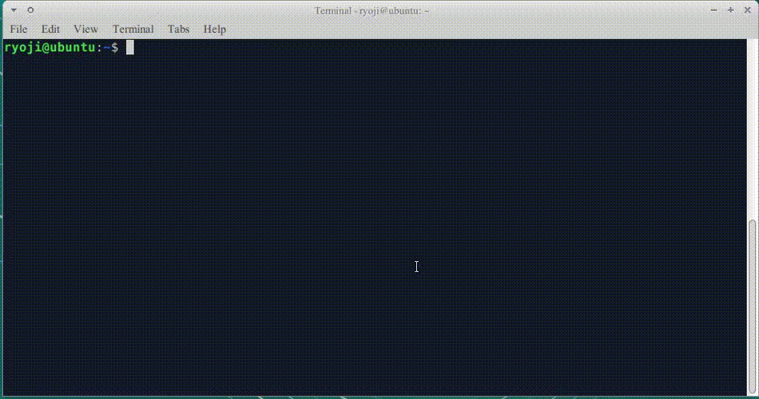
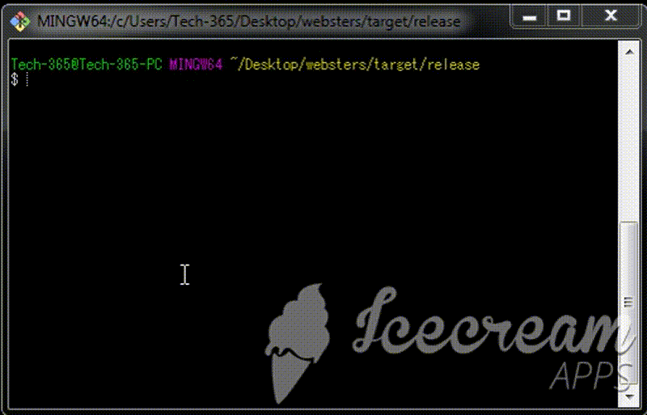

# Websters dictionary, 1913 Edition 


websters1913 is a command line program for reading Webster's Dictionary, 1913 in a terminal. This program provides the full text search. Application binary contains the dictionary data. It's using `less` as the pager.

# Linux x64

## Websters

A. static binary

```
wget https://raw.githubusercontent.com/growingspaghetti/websters-1913-console-dictionary/master/websters1913
./websters1913
```

There's little chance your terminal locale is not utf8.

```
export LANG="en_US.UTF-8"; export LESSCHARSET="utf-8"; ./websters1913
```

DejaVu fonts have got all glyphs.

B. via snap packager, https://snapcraft.io/websters1913/

```
sudo snap install websters1913
websters1913
```
Note: static binary starts up faster than the snap edition.

## Wordnet 2.0


```
wget https://raw.githubusercontent.com/growingspaghetti/websters-1913-console-dictionary/master/wordnet2
./wordnet2
```
```
sudo snap install wordnet2 #https://snapcraft.io/wordnet2/
wordnet2
```

## WordNet2.0+Websters1913



```
wget https://raw.githubusercontent.com/growingspaghetti/websters-1913-console-dictionary/master/wn2websters1913
./wn2websters1913
```
```
sudo snap install wn2websters1913 #https://snapcraft.io/wn2websters1913/
wn2websters1913
```

# Windows x64



Git bash is required. 

```
curl -O https://raw.githubusercontent.com/growingspaghetti/websters-1913-console-dictionary/master/websters1913.exe
./websters1913.exe
```

Compiled in Windows 7.

# License

* Public domain: https://en.wiktionary.org/wiki/Wiktionary:Webster%27s_Dictionary,_1913
* Non commercial and research purpose only: svr-ftp.eng.cam.ac.uk/comp.speech/dictionaries/beep.tar.gz
* http://wordnetcode.princeton.edu
```
WordNet 2.0 Copyright 2003 by Princeton University.  All rights reserved. 

THIS SOFTWARE AND DATABASE IS PROVIDED "AS IS" AND PRINCETON  
UNIVERSITY MAKES NO REPRESENTATIONS OR WARRANTIES, EXPRESS OR  
IMPLIED.  BY WAY OF EXAMPLE, BUT NOT LIMITATION, PRINCETON  
UNIVERSITY MAKES NO REPRESENTATIONS OR WARRANTIES OF MERCHANT-  
ABILITY OR FITNESS FOR ANY PARTICULAR PURPOSE OR THAT THE USE  
OF THE LICENSED SOFTWARE, DATABASE OR DOCUMENTATION WILL NOT  
INFRINGE ANY THIRD PARTY PATENTS, COPYRIGHTS, TRADEMARKS OR  
OTHER RIGHTS.  
```
* Rust source code: MIT

# Change logs

 * 2019/04/06 v0.1.0
 * 2019/04/07 v0.2.0 pronunciation notations have been added to the websters dictionary.
 * 2019/04/08 created binaries for wordnet 2.0 as well as websters 1913.
 
